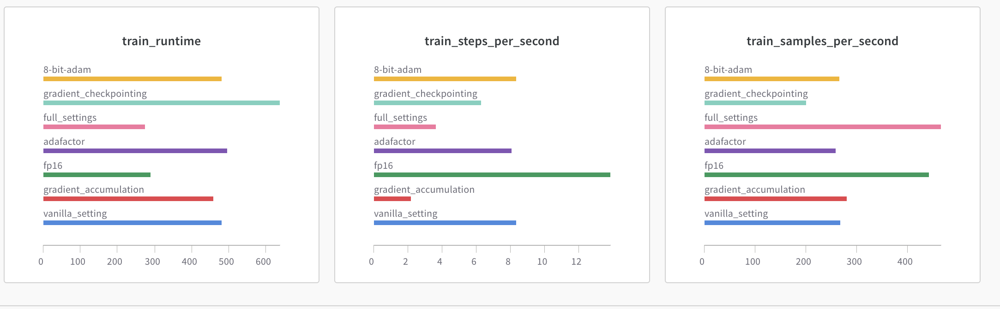
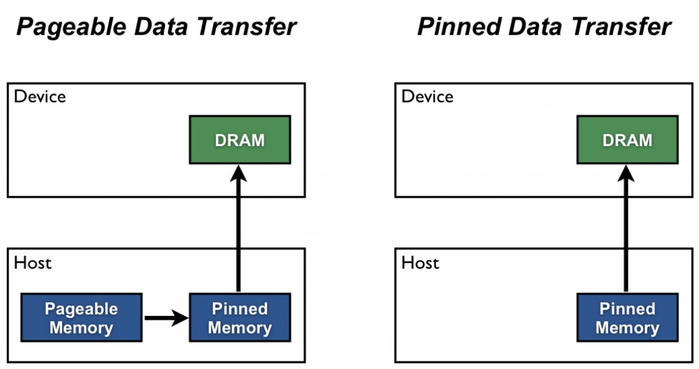
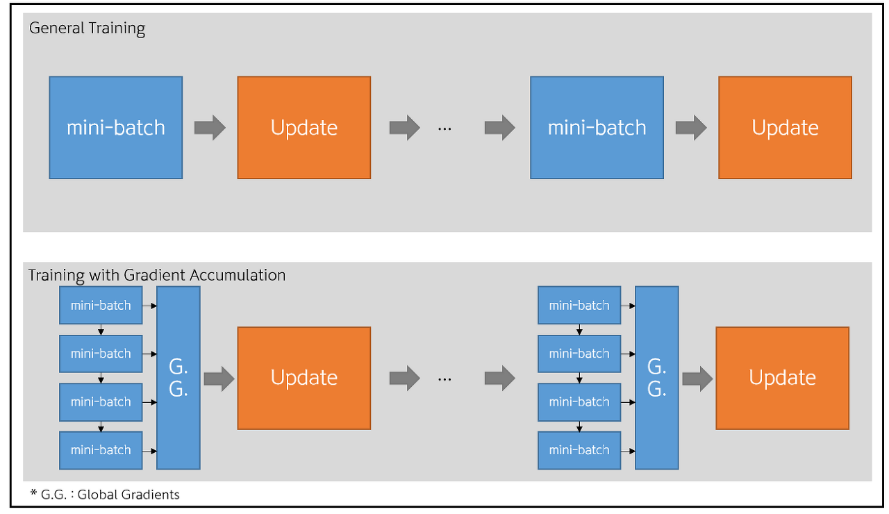
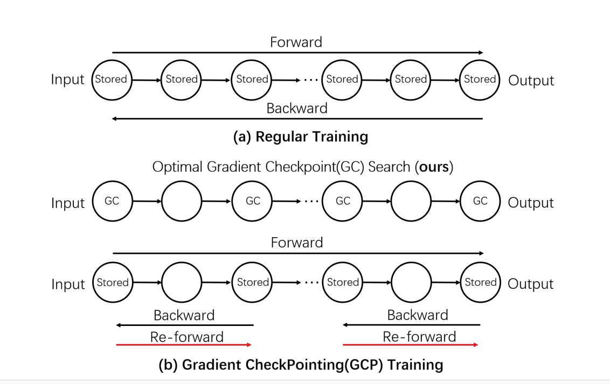
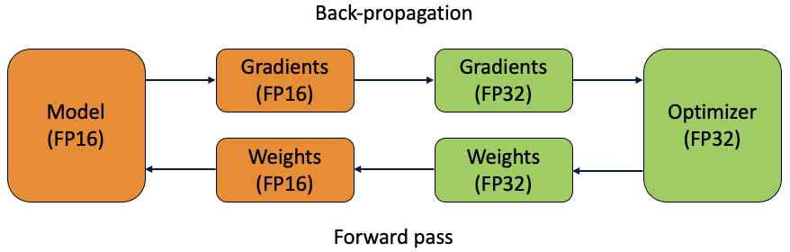
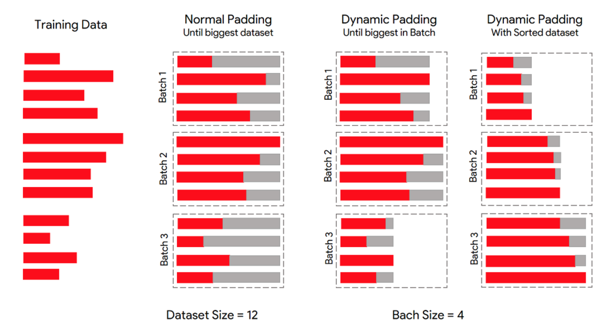

# Optimzation strategies to speed up training.

    
  

In a low-resource setup like Google Colab, training/fine-tuning state-of-the-art Transformer based models with GPU becomes a pain as we often run into 
memory issues.

CUDA out of memory errors or GPU Runtime Limit Reached errors are frequent whenever we train such models with a large batch or more epochs even with a shrinked version of the model such as DistillBert.

Here I tried some strategies which helped bring down the training time from ~35 mins to ~10 mins on a single GPU(Tesla T4) machine for 1.5 Lac training data.

Each method can improve speed or memory usage which is summarized in the table below:

| Method.               | Speed.        | Memory|
| --------------------- | ------------- |-------
|Gradient accumulation  | No            | Yes
|Gradient checkpointing | No            | Yes
|Mixed precision training | Yes         | No
|Batch Size | Yes         | No
|DataLoader | Yes         | No

## Reports from wandb

## 1. Using DataLoader to increase num_worker.

   PyTorch allows loading data on multiple processes simultaneously, so we can increase the num_workers value to a non-zero value.
   A good rule of thumb is num_worker = 4 * num_GPU.
 
   
   

## 2. Using pin_memory.

  Set pin_memory as True in DataLoader. (DataLoader(dataset, pin_memory = True))

  
  
  As seen in the figure, pinned memory is used as a staging area for transfers from the device to the host. We can avoid the cost of the transfer between pageable and pinned host arrays by directly allocating our host arrays in pinned memory.
  Pinned memory is used to speed up a CPU to GPU memory copy operation (as executed by e.g. tensor.cuda() in PyTorch) by ensuring that none of the memory that is to be copied is on disk. Memory cached to disk has to be read into RAM before it can be transferred to the GPU—e.g. it has to be copied twice.
  More information on the [NVIDIA Blog](https://developer.nvidia.com/blog/how-optimize-data-transfers-cuda-cc/)
  
     
      

## 3. Gradient Accumulation.

 

When training a neural network, we usually divide our data in mini-batches and go through them one by one. The network predicts batch labels, which are used to compute the loss with respect to the actual targets. Next, we perform backward pass to compute gradients and update model weights in the direction of those gradients.

Gradient accumulation modifies the last step of the training process. Instead of updating the network weights on every batch, we can save gradient values, proceed to the next batch and add up the new gradients. The weight update is then done only after several batches have been processed by the model.

    
    
    
## 4. Gradient CheckPointing.

Gradient checkpointing works by omitting some of the activation values from the computational graph. This reduces the memory used by the computational graph, reducing memory pressure overall (and allowing larger batch sizes in the process).

However, the reason that the activations are stored in the first place is that they are needed when calculating the gradient during backpropagation. Omitting them from the computational graph forces PyTorch to recalculate these values wherever they appear, slowing down computation overall.

 
 
 

## 5. Mixed Precision Training.

Mixed-precision training is a technique for substantially reducing neural net training time by performing as many operations as possible in half-precision floating point, fp16, instead of the (PyTorch default) single-precision floating point, fp32. 

The basic idea behind mixed precision training is simple: halve the precision (fp32 → fp16), halve the training time.

A master copy of the weights is stored in FP32. This is converted into FP16 during part of each training iteration (one forward pass, back-propagation and weight update). 
At the end of the iteration, the weight gradients are used to update the master weights during the optimizer step.
    

## TO DO
## 6. Dynamic Padding + Smart Batching.

The main idea behind the 2 optimizations is to avoid as much unused computation as possible:

**Dynamic padding**: We limit the number of added pad tokens to reach the length of the longest sequence of each mini batch instead of a fixed value set for the whole train set. Because the number of added tokens changes across mini batches, we call it “dynamic” padding.

**Uniform length batching**: We push the logic further by generating batches made of similar length sequences, so we avoid extreme cases where most sequences in the mini batch are short and we are required to add lots of pad tokens to each of them because 1 sequence of the same mini batch is very long.

References: [NVIDIA Blog](https://developer.nvidia.com/blog/how-optimize-data-transfers-cuda-cc/)\
                                                                                                                                                                     [Mixed Precision Training](https://docs.nvidia.com/deeplearning/performance/mixed-precision-training/index.html)\
            [Dynamic Padding](https://sajjjadayobi.github.io/blog/tips/2021/08/09/sortish-bathes.html)  
            [Optimal Gradient Checkpoint Search for Arbitrary Computation Graphs](https://paperswithcode.com/paper/cutting-down-training-memory-by-re-fowarding)\
            [Divide Training time](https://towardsdatascience.com/divide-hugging-face-transformers-training-time-by-2-or-more-21bf7129db9q-21bf7129db9e)\
            [velog.io](https://velog.io/@twinjuy/OOM%EB%A5%BC-%ED%95%B4%EA%B2%B0%ED%95%98%EA%B8%B0-%EC%9C%84%ED%95%9C-Batch-Accumulation)\
        [How To Fit a Bigger Model and Train It Faster](https://huggingface.co/docs/transformers/performance#faster-training)
